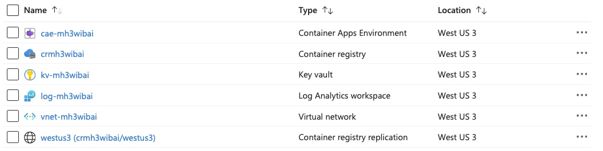
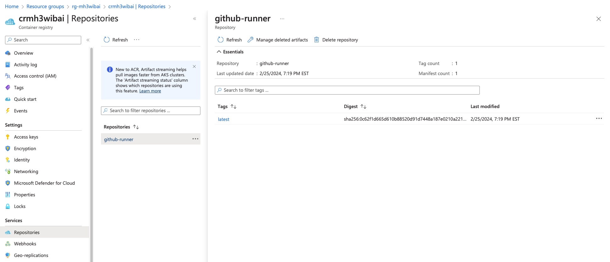

# Overview
This module library contains two modules. The first module that provisions a Container App Environment and other Azure resources to host one or more GitHub Custom Runners as Container App Jobs. The second module provisions a Container App Job that will act as a GitHub Custom Runner for the specified GitHub repository. This Container App Job uses the container image and the GitHub token stored in KeyVault from the host environment.

## Host Environment

This Terraform module provisions a container app environment optimized for hosting a GitHub Custom Runner as a container app job. The environment includes a Key Vault for storing the GitHub token, an Azure Container Registry (ACR) for the container image, a Log Analytics workspace for Azure Monitor logging, and a virtual network for secure communication.

This module will run Docker in a `null_resource` to create the GitHub Runner container image that is needed for the GitHub Custom Runner. Make sure you Docker Desktop is running when you execute this locally.

If the Docker image is built and pushed successfully you will see it in the Azure Container Registry under the `github-runner` repository.